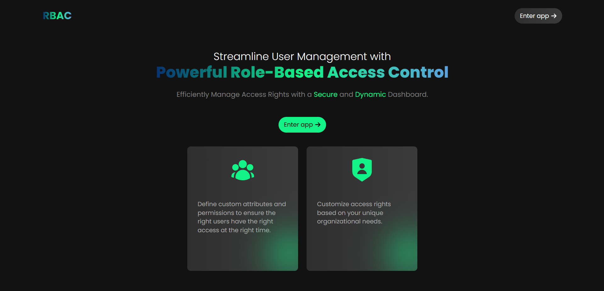
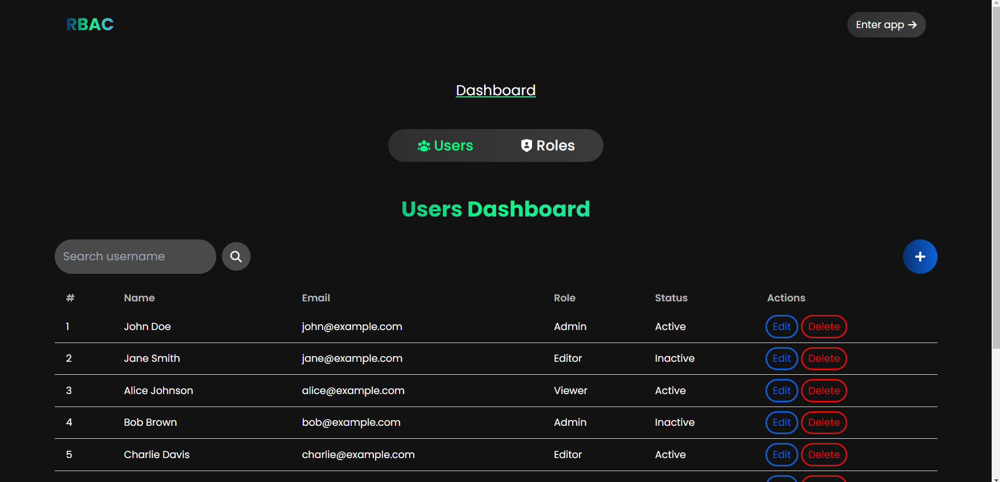
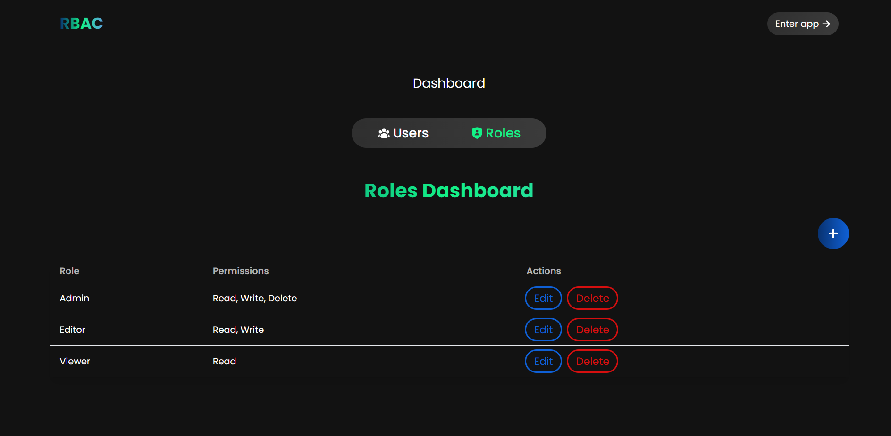

## RBAC UI 

A Role-Based Access Control (RBAC) admin dashboard for managing users, roles, and permissions dynamically. This application simplifies access control by providing an intuitive interface to manage who can do what within a system.

#### Live Link
[https://rbac-ui-red.vercel.app](https://rbac-ui-red.vercel.app/)





# RBAC-UI


## 🌟 Features

- **User Management**  
  Add, edit, and delete users with role-based assignments.  
  View user details and associated permissions.  

- **Role Management**  
  Create, update, and delete roles dynamically.  
  Assign permissions to roles to control access.  

- **Permission Management**  
  Define granular permissions that can be associated with roles.  

- **Dynamic Access Control**  
  Manage access control dynamically without hardcoding rules.  
  Update roles and permissions in real-time.  

- **Responsive UI**  
  Optimized for desktops, tablets, and mobile devices.  

---

## 🚀 Tech Stack

- **Frontend**: React, Tailwind CSS   
- **Deployment**: Vercel  

---

## 📦 Installation & Setup

1. **Clone the repository**  
   ```sh
   git clone https://github.com/isayanpal/rbac-ui.git
   cd rbac-ui
   ```

2. **Install frontend dependencies**

   ```sh
   npm install
   ```


3. **Start the frontend server**

   ```sh
   npm run dev
   ```

4. Open your browser and navigate to `http://localhost:5173/`.

## Happy Coding ❤️